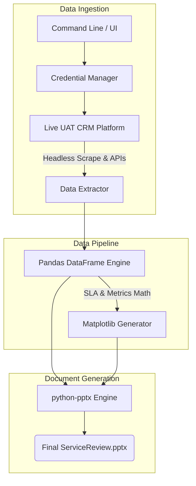
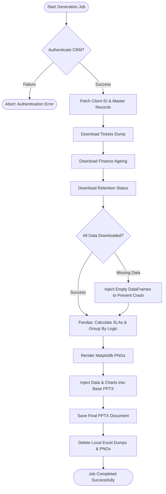

# Enterprise CRM PowerPoint Automation Platform

> An enterprise-grade Python automation pipeline that dynamically extracts live CRM data, calculates SLAs via Pandas, and generates publication-ready PowerPoint presentations for executive Service Reviews.

## 🚀 Project Impact
- **Automates** manual CRM data extraction, cleaning, and SLA calculations.
- **Eliminates** human error in financial ageing and technical ticket resolution reporting.
- **Generates** complete, native `.pptx` documents with embedded data and perfectly scaled Matplotlib charts in seconds.

## 💻 Tech Stack
| Layer | Technology | Purpose |
| :--- | :--- | :--- |
| **Core Language** | `Python 3.10+` | Backbone of the data processing pipeline |
| **Data Processing** | `pandas` | Financial aggregation & SLA mathematics |
| **Visualization** | `matplotlib` | Dynamic generation of trend charts & graphics |
| **Document Engine**| `python-pptx` | Native PowerPoint manipulation & shape generation |
| **Browser Automation**| `Playwright` & `requests` | Headless CRM navigation & secure API extraction |
| **Frontend UI** | `React 18`, `TypeScript` | Dashboard for triggering & monitoring generation jobs |

## 🏗️ System Architecture


## 🔄 Activity Flow Diagram


## ⚙️ Installation & Configuration
1. **Install Python 3.10+**
2. Install project dependencies:
   ```bash
   pip install -r backend/requirements.txt
   playwright install chromium
   ```
3. Configure your production environment (`.env`):
   ```env
   CRM_URL=http://27.54.160.8/devops/uatPortal
   CRM_USERNAME=your_username
   CRM_PASSWORD=your_password
   ```

## 🏃‍♂️ Usage
Trigger the fully automated pipeline for a specific client and billing month. The engine will authenticate, scrape the required data, process it, and output the final document.
```bash
python backend/main.py --production --customer "M/s. Picson Construction Equipments Pvt. Ltd." --month "2026-08" --user "Shah.Manank"
```

## 📊 CRM to Slide Mapping Strategy
The pipeline strictly maps dynamic CRM endpoints to specific PowerPoint slide templates.

| Slide Content | CRM Data Source | Python Processor Pipeline |
| :--- | :--- | :--- |
| **Customer Service** | Active Services JSON API | `process_inventory.py` |
| **Ticket Analytics** | Help Desk `All Complain` Excel Dump | `raw_ticket_processor.py` |
| **SLA Resolution** | Incident RFO & Close Date Engine | `process_sla.py` |
| **Invoice Pendency** | Finance `Client Ageing` JSON/Excel | `process_invoice.py` |
| **Retention Metrics** | Client Retention Stage Data | `process_retention.py` |

*Note: Comprehensive field-level technical mappings between the exact CRM JSON endpoints and the PowerPoint placeholder variables are securely documented in the `/Slide_Mappings` directory.*
