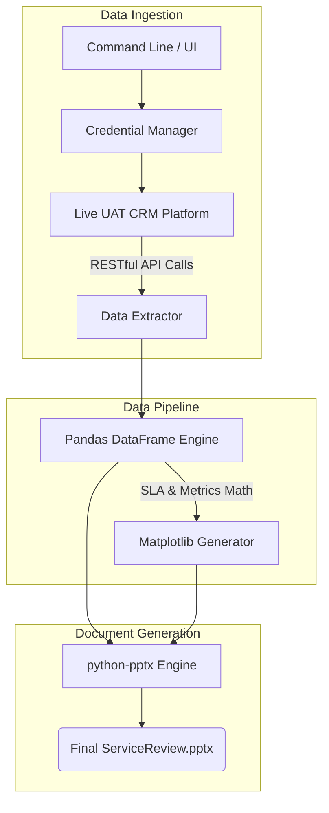
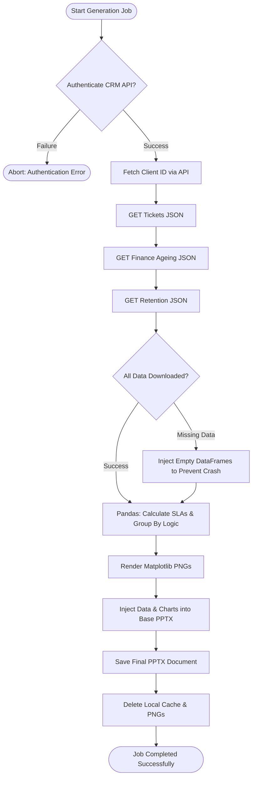

# Enterprise MBR Automation Engine

> An end-to-end MBR (Monthly Business Review) Automation Engine built with Python, FastAPI, Pandas, python-pptx, and React. It dynamically extracts live CRM data to automate SLA, invoice ageing, inventory, and outage analysis.

## 🚀 Project Impact
- **Automates** complex CRM-based SLA math, invoice ageing, inventory tracking, and technical outage analysis.
- **Accelerates** workflow efficiency by reducing comprehensive MBR report generation from hours of manual labor to **<10 seconds** per client.
- **Generates** complete, native `.pptx` documents with embedded data and perfectly scaled Matplotlib charts.

## 💻 Tech Stack
| Layer | Technology | Purpose |
| :--- | :--- | :--- |
| **Core API & Logic** | `Python 3.10+`, `FastAPI` | Backbone of the data processing pipeline and REST API |
| **Data Processing** | `pandas` | Financial aggregation & SLA mathematics |
| **Visualization** | `matplotlib` | Dynamic generation of trend charts & graphics |
| **Document Engine**| `python-pptx` | Native PowerPoint manipulation & shape generation |
| **API Integration**| `requests` & internal REST clients | Secure authentication & extraction from live CRM endpoints |
| **Frontend UI** | `React 18`, `TypeScript` | Dashboard for triggering & monitoring generation jobs |

## 🏗️ System Architecture


## 🔄 Activity Flow Diagram


## ⚙️ Installation & Configuration
1. **Install Python 3.10+**
2. Install project dependencies:
   ```bash
   pip install -r backend/requirements.txt
   ```
3. Configure your production environment (`.env`):
   ```env
   CRM_API_URL=http://27.54.160.8/devops/uatPortal/api
   CRM_API_TOKEN=your_secure_token
   ```

## 🏃‍♂️ Usage
Trigger the fully automated pipeline for a specific client and billing month. The engine will authenticate, extract data via API, process it, and output the final document.
```bash
python backend/main.py --production --customer "M/s. Picson Construction Equipments Pvt. Ltd." --month "2026-08" --user "Shah.Manank"
```

## 📊 CRM to Slide Mapping Strategy
The pipeline strictly maps dynamic CRM endpoints to specific PowerPoint slide templates.

| Slide Content | CRM Data Source | Python Processor Pipeline |
| :--- | :--- | :--- |
| **Customer Service** | Active Services JSON API | `process_inventory.py` |
| **Ticket Analytics** | Help Desk REST API | `raw_ticket_processor.py` |
| **SLA Resolution** | Incident RFO & Close Date Engine | `process_sla.py` |
| **Invoice Pendency** | Finance `Client Ageing` API | `process_invoice.py` |
| **Retention Metrics** | Client Retention Stage API | `process_retention.py` |

*Note: Comprehensive field-level technical mappings between the exact CRM JSON endpoints and the PowerPoint placeholder variables are securely documented in the `/Slide_Mappings` directory.*

---

## 🏷️ Project Domain & Classification
This project spans several high-demand enterprise software domains:
* **API Integration & Microservices:** Authenticates and securely interfaces with live internal REST APIs to extract highly relational business data.
* **Data Engineering & Processing:** Utilizes `pandas` to clean, transform, and aggregate thousands of rows of raw financial and technical data into mathematical metrics.
* **Document Automation:** Programmatically manipulates binary `.pptx` XML structures to generate dynamic, presentation-ready business reports.
* **Full-Stack Development:** Orchestrates backend Python pipelines with an optional React/TypeScript dashboard interface.
