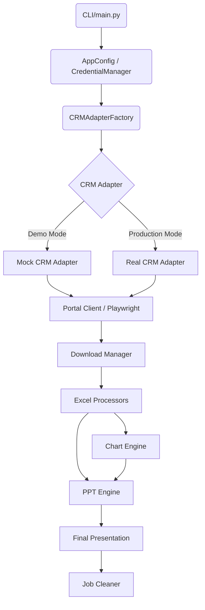

# Enterprise PPT Automation Platform

A production-ready enterprise application for automating the generation of Service Review PowerPoint presentations. The platform extracts data via an automated CRM browser session, processes and aggregates Excel reports, generates publication-quality Matplotlib charts, and strictly maps data into an existing PowerPoint template.

## Architecture Flow

The system orchestrates operations via dependency injection in `PPTAutomationPipeline`, decoupling browser automation from data processing and chart generation.



## Folder Structure
```text
CustPPTAutomation/
├── backend/
│   ├── main.py                    # CLI Entrypoint
│   ├── config/                    # Configuration, Flags, Credentials
│   ├── automation/                # Playwright framework & CRM Adapters
│   ├── processors/                # Excel validation & data processing
│   ├── charts/                    # Matplotlib chart engine
│   ├── ppt/                       # python-pptx presentation generation
│   ├── services/                  # Orchestration (Pipeline, Metrics, Job Manager)
│   ├── utils/                     # Logging, Exceptions
│   ├── tests/                     # Unit Tests & Fixtures
│   ├── logs/                      # Screenshots & App Logs
│   ├── output/                    # Downloads, Charts, and Presentations
│   └── templates/                 # Base ServiceReview.pptx
├── .env                           # Environment Variables (Not Committed)
├── README.md
└── requirements.txt
```

## Installation
1. Install Python 3.10+
2. `pip install -r backend/requirements.txt`
3. `playwright install chromium`
4. Copy `.env.example` to `.env` (if provided) and fill required values for Production mode.

## Configuration (.env)
```env
CRM_URL=https://real-crm.example.com
CRM_USERNAME=your_username
CRM_PASSWORD=your_password
DOWNLOAD_PATH=output/downloads
OUTPUT_PATH=output/presentations
HEADLESS=true
TIMEOUT=30000
RETRY_COUNT=3

# Feature Flags
ENABLE_DOWNLOAD=true
ENABLE_SCREENSHOTS=true
ENABLE_CLEANUP=true
```

## Usage (CLI)

The `main.py` entrypoint requires either `--demo` or `--production` mode.

### Demo Mode (Recommended for testing)
Runs the entire pipeline instantly without requiring actual CRM credentials. Uses static dummy data specifically engineered for the `Picson` customer to perfectly populate charts and tables.
```bash
python backend/main.py --demo --customer "Picson" --month "2026-08"
```

### Production Mode
Runs the pipeline against the live CRM. Requires valid Ishan CRM credentials configured in your environment variables.
```bash
python backend/main.py --production --customer "M/s. Picson Construction Equipments Pvt. Ltd." --month "2026-08" --user "Shah.Manank"
```

*Optional flags:*
- `--output ./custom_folder` (Overrides default output path)

## Documentation & Slide Mappings
The system has been heavily audited against the live CRM. For a complete 1:1 mapping of exactly which backend CRM endpoints and UI columns generate each PPT slide (including the exact SLA calculations for Slide 8 and Invoice mappings for Slide 12), please see the internal `/Slide_Mappings` folder or the `PPT_Automation_Mapping_Documentation.md`.

## Transitioning to Production

When you are ready to integrate the real CRM:
1. Open `backend/config/portal.json` and replace the placeholder CSS/XPath selectors with the actual CRM selectors.
2. Open `backend/automation/real_crm_adapter.py`.
3. Implement the `open_dashboard`, `select_customer`, and `download_*` methods. Remove the `NotImplementedError` raises.
4. Set `APP_MODE=production` in your environment (or use `--production`).
5. Fill your `.env` with actual `CRM_USERNAME` and `CRM_PASSWORD`.

The `AdapterFactory` will automatically inject `RealCRMAdapter` and execute the pipeline!
