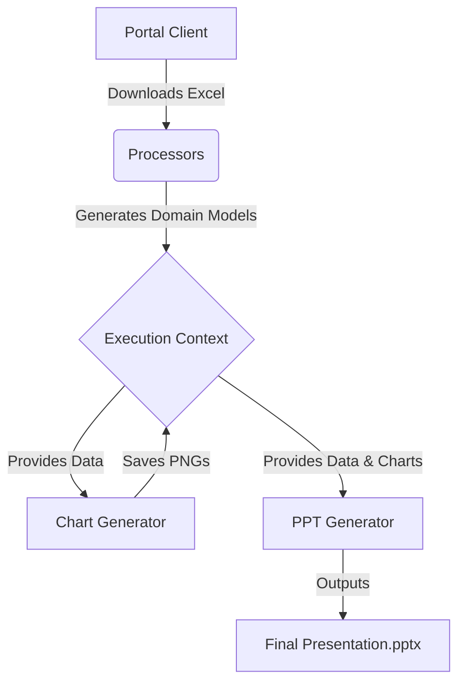
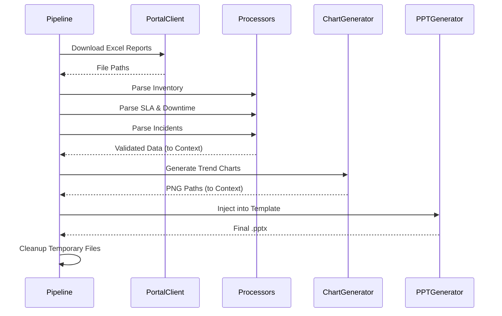

# Customer Service PPT Automation - Technical Architecture

This document provides a comprehensive technical overview of the Customer Service PPT Automation Backend. It is designed to onboard new engineers by detailing the system architecture, data processing flows, configuration, and execution pipeline.

---

## 1. System Architecture

The application is designed using a **modular pipeline architecture**. Responsibilities are cleanly separated into dedicated components:
- **Orchestrator (`PPTAutomationPipeline`)**: Manages the end-to-end execution of a single report job.
- **Processors**: Stateless, single-responsibility classes that ingest raw Excel files and output validated domain models.
- **Chart Generator**: Uses `matplotlib` to render trend lines and bar charts as PNG files.
- **PPT Generator**: A templating engine powered by `python-pptx` that injects text, tables, and images into a base PowerPoint file.

---

## 2. Pipeline Execution Flow

The `PPTAutomationPipeline` executes strictly sequentially. If any stage fails, the pipeline halts, logs the error, attempts cleanup, and notifies the caller.

---

## 3. Data Processing Flow

Each specific processor inherits from `BaseProcessor` and follows this internal flow:
1. **Load**: `pandas.read_excel()` reads the raw data into memory.
2. **Clean**: Strip whitespace from string columns and convert string `nan`/`None` to actual `None`.
3. **Normalize**: Specifically handles duplicate `Customer ID`s for identical names based on the configured strategy.
4. **Validate**: Ensures required columns exist and the filtered subset is not empty.
5. **Process**: Applies business logic (grouping, filtering) and returns Python domain objects (e.g., `InventoryRecord`).

---

## 4. PowerPoint Generation Flow

The PPT engine uses a **Dictionary-Based Replacement Strategy**. We avoid hardcoding coordinates or indices where possible.

1. **Text Replacer**: Scans all shapes on every slide. Replaces tokens like `{{customer_name}}` globally.
2. **Image Replacer**: Looks for specific placeholder shapes by name (e.g., `"{{sla_trend_chart}}"`) and overlays the corresponding PNG chart over the shape's exact dimensions.
3. **Table Replacer**: Specific handler classes (e.g., `Slide5Inventory`) locate tables by shape name (e.g., `"{{inventory_table}}"`) and populate them row by row dynamically.

---

## 5. Configuration Guide

System configurations are centralized in `backend/config/app_config.py`.

- **NORMALIZATION_STRATEGY**: Determines how duplicate Customer IDs are handled (`REPORT_ONLY` [default], `AUTO`, `MANUAL`).
- **SLA_THRESHOLDS**: A dictionary defining SLA breach limits for specific metrics (e.g., `Point_6`, `Response_Time`). Defaults to `None` (ignores validation) until business logic is confirmed.
- **Directories**: Automates the creation of `config`, `logs`, `downloads`, `outputs`, and `templates` folders.

---

## 6. ExecutionContext Documentation

`ExecutionContext` (`execution_context.py`) acts as the central data bus for a single job. It isolates state between concurrent runs.

- **Inputs**: `customer_id`, `report_month`, `job_id`.
- **State**: `start_time`, `end_time`, intermediate `download_paths` and `chart_paths`.
- **Data (Lists/Models)**: Stored in the `data` dictionary (e.g., `ctx.data["inventory_records"]`).
- **Summary (Aggregations)**: Stored in the `summary` dictionary (e.g., `ctx.summary["retention_pending_customers"]`). Prevents polluting the `data` dict with simple scalars.

---

## 7. Processor Responsibilities

- **`BaseProcessor`**: Handles generic file loading, cleaning, normalization, and empty validation.
- **`InventoryProcessor`**: Calculates link counts grouped by Service Type, as well as Retention Pending services and customers.
- **`SLAProcessor`**: Calculates availability, latency trends, below-SLA links, and major downtimes over a multi-month period.
- **`IncidentProcessor`**: Summarizes P1/P2 incident tickets grouped by location.

---

## 8. Validation Flow

Validation logic is decoupled into `validators.py` to ensure reusability.
- `validate_required_columns()`: Halts execution if a report format changes.
- `validate_customer_exists()`: Halts execution if the downloaded report contains no data for the requested customer.
- `validate_sla_metrics()`: Non-fatal validation. Logs warnings if SLAs drop below defined thresholds in `AppConfig`.

---

## 9. Testing Strategy

The project uses `pytest` for unit and integration testing.
- **Fixtures**: Located in `backend/tests/fixtures/`, providing dummy Excel reports for deterministic testing.
- **Processor Tests**: Validate the transformation logic without requiring network requests.
- **PPT Tests**: Inject a dummy 4-slide `Presentation()` object to test slide handler classes in isolation without invoking the full templating engine.
- **Command**: Run `python -m pytest backend/tests/` inside the virtual environment.

---

## 10. Deployment Guide

1. **Python Environment**: Requires Python 3.10+.
2. **Install Dependencies**: `pip install -r requirements.txt`.
3. **Playwright Setup**: Run `playwright install chromium` to initialize the headless browser used by the `PortalClient`.
4. **Templates**: Ensure `ServiceReview.pptx` exists in `backend/templates/`.
5. **Start Pipeline**: Invoke the `PPTAutomationPipeline.execute()` method programmatically via API or CLI.

---

## 11. Known Limitations

- **Excel Layout Dependency**: Processors strictly depend on specific column string names. If the reporting portal changes an export column name (e.g., "Service Status" to "State"), a `ExcelValidationError` is raised.
- **Chart Categorical Units**: Matplotlib logs categorical unit warnings if X-axis month strings are parsed directly. This is benign but litters logs.
- **PPT Slide Handlers**: `Slide6Performance`, `Slide7LocationSLA`, etc., currently hardcode their integer slide index mappings internally (e.g., Slide 2, Slide 3). If new slides are inserted into the template before them, these indices must be updated.

---

## 12. Future Enhancements

- **Slide 13 Support**: A placeholder is currently reserved in `pipeline.py`. Logic must be built once business requirements are clarified.
- **Invoice Pendency Module**: A new processor must be created to parse financial/billing exports.
- **Dynamic Slide Indices**: Enhance `PPTGenerator` to dynamically locate slides based on hidden text tags or slide names, rather than relying on hardcoded integer index arrays.
